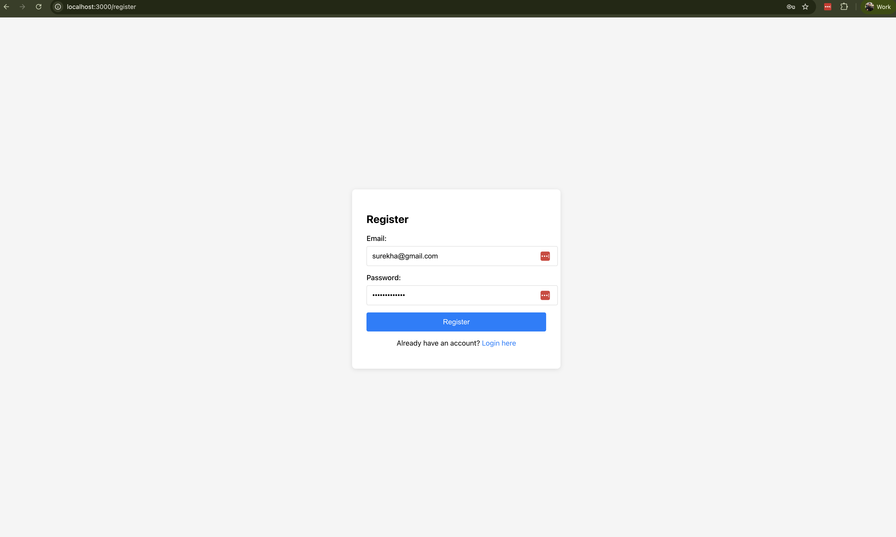

# 🚀 Task 2: Complete CI/CD Pipeline with React + Node.js + Firebase + Redis

A comprehensive CI/CD pipeline implementation featuring React frontend, Node.js backend, Firebase authentication, Redis caching, Kubernetes orchestration, and automated monitoring with Uptime Kuma.

## 📋 Project Overview

This project demonstrates a production-ready CI/CD pipeline with the following components:

- **Frontend**: React 18 with Firebase Authentication
- **Backend**: Node.js/Express with Firebase Admin SDK
- **Database**: Redis for caching and session management
- **Containerization**: Docker and Docker Compose
- **Orchestration**: Kubernetes with multi-environment support
- **CI/CD**: GitHub Actions with automated testing and deployment
- **Monitoring**: Uptime Kuma with Slack notifications
- **Caching**: Redis with intelligent cache management

## 🏗️ Architecture Diagram

```
┌─────────────────────────────────────────────────────────────────┐
│                        GitHub Repository                        │
│  ┌─────────────┐  ┌─────────────┐  ┌─────────────┐            │
│  │   Frontend  │  │   Backend   │  │   Redis     │            │
│  │   React     │  │   Node.js   │  │   Cache     │            │
│  │   + Firebase│  │   + Express │  │   + AOF     │            │
│  └─────────────┘  └─────────────┘  └─────────────┘            │
└─────────────────────────────────────────────────────────────────┘
                                │
                                ▼
┌─────────────────────────────────────────────────────────────────┐
│                    GitHub Actions CI/CD                         │
│  ┌─────────────┐  ┌─────────────┐  ┌─────────────┐            │
│  │   Lint &    │  │   Build &   │  │   Deploy &  │            │
│  │   Test      │  │   Push       │  │   Monitor   │            │
│  │   ESLint    │  │   Docker     │  │   K8s       │            │
│  │   Jest      │  │   Registry   │  │   Uptime    │            │
│  └─────────────┘  └─────────────┘  └─────────────┘            │
└─────────────────────────────────────────────────────────────────┘
                                │
                                ▼
┌─────────────────────────────────────────────────────────────────┐
│                    Docker Registry                              │
│  ┌─────────────┐  ┌─────────────┐  ┌─────────────┐            │
│  │ Frontend    │  │ Backend     │  │ Redis       │            │
│  │ Image       │  │ Image       │  │ Image       │            │
│  │ :latest     │  │ :latest     │  │ :7-alpine   │            │
│  └─────────────┘  └─────────────┘  └─────────────┘            │
└─────────────────────────────────────────────────────────────────┘
                                │
                                ▼
┌─────────────────────────────────────────────────────────────────┐
│                    Kubernetes Clusters                          │
│  ┌─────────────────┐                    ┌─────────────────┐    │
│  │   Staging       │                    │   Production    │    │
│  │   Environment   │                    │   Environment   │    │
│  │                 │                    │                 │    │
│  │ ┌─────────────┐ │                    │ ┌─────────────┐ │    │
│  │ │ Frontend    │ │                    │ │ Frontend    │ │    │
│  │ │ Backend     │ │                    │ │ Backend     │ │    │
│  │ │ Redis       │ │                    │ │ Redis       │ │    │
│  │ └─────────────┘ │                    │ └─────────────┘ │    │
│  └─────────────────┘                    └─────────────────┘    │
└─────────────────────────────────────────────────────────────────┘
                                │
                                ▼
┌─────────────────────────────────────────────────────────────────┐
│                    Monitoring & Alerting                        │
│  ┌─────────────┐  ┌─────────────┐  ┌─────────────┐            │
│  │ Uptime Kuma │  │ Slack       │  │ Redis       │            │
│  │ Monitoring  │  │ Notifications│  │ Commander   │            │
│  │ + Alerts    │  │ + Webhooks  │  │ + Cache     │            │
│  └─────────────┘  └─────────────┘  └─────────────┘            │
└─────────────────────────────────────────────────────────────────┘
```

## 📁 Project Structure

```
task-2-cicd-pipeline/
├── 📁 frontend/                    # React Frontend Application
│   ├── 📄 package.json            # Dependencies and scripts
│   ├── 📄 Dockerfile              # Frontend containerization
│   ├── 📁 src/
│   │   ├── 📄 App.js              # Main React application
│   │   ├── 📄 index.js            # React entry point
│   │   └── 📁 components/         # React components
│   └── 📁 public/                 # Static assets
│
├── 📁 backend/                     # Node.js Backend Application
│   ├── 📄 package.json            # Dependencies and scripts
│   ├── 📄 Dockerfile              # Backend containerization
│   ├── 📄 index.js                # Express server setup
│   ├── 📄 firebase-admin.js       # Firebase Admin SDK config
│   └── 📄 redis-service.js        # Redis caching service
│
├── 📁 k8s/                        # Kubernetes Manifests
│   ├── 📄 namespace.yaml          # Application namespace
│   ├── 📄 configmap.yaml          # Environment configuration
│   ├── 📄 secret.yaml             # Sensitive data (Firebase)
│   ├── 📄 frontend-deployment.yaml # Frontend deployment
│   ├── 📄 backend-deployment.yaml # Backend deployment
│   ├── 📄 redis-deployment.yaml   # Redis deployment
│   ├── 📄 services.yaml           # Service definitions
│   └── 📄 deploy.sh               # Deployment script
│
├── 📁 .github/                     # GitHub Actions CI/CD
│   └── 📁 workflows/
│       └── 📄 ci-cd.yml           # Main CI/CD pipeline
│
├── 📁 monitoring/                  # Monitoring & Alerting
│   ├── 📄 docker-compose.yml      # Monitoring services
│   ├── 📄 uptime-kuma-config.json # Uptime Kuma configuration
│   └── 📄 setup-monitoring.sh     # Monitoring setup script
│
├── 📁 scripts/                     # Utility Scripts
│   └── 📄 cache-management.sh     # Redis cache management
│
├── 📄 docker-compose.yml          # Local development setup
├── 📄 README.md                   # This file
└── 📄 FIREBASE_SETUP.md          # Firebase configuration guide
```

## 📸 Application Screenshots

### 🔐 User Registration

*Registration page with Firebase authentication integration*

### 🎯 Dashboard with Backend Data

*Dashboard displaying cached backend data with user authentication*

### 🔐 User Registration (Alternative View)

*Registration form with email and password fields*

---

## 🚀 Quick Start Guide

### Prerequisites

- **Docker & Docker Compose**: For local development
- **Node.js 18+**: For local development
- **Kubernetes Cluster**: For production deployment (minikube for local testing)
- **GitHub Account**: For CI/CD pipeline
- **Firebase Project**: For authentication
- **Slack Workspace**: For notifications (optional)

### 1. Local Development Setup

```bash
# Clone the repository
git clone <repository-url>
cd task-2-cicd-pipeline

# Install dependencies
cd frontend && npm install && cd ..
cd backend && npm install && cd ..

# Start all services with Docker Compose
docker-compose up -d

# Verify services are running
docker-compose ps

# Access the application
# Frontend: http://localhost:3000
# Backend API: http://localhost:8000
# Redis: localhost:6379
```

### 2. Firebase Configuration

```bash
# Follow the Firebase setup guide
cat FIREBASE_SETUP.md

# Update environment variables
cp .env.example .env
# Edit .env with your Firebase credentials
```

### 3. Kubernetes Deployment

```bash
# Start minikube (if using local cluster)
minikube start

# Deploy to Kubernetes
cd k8s
./deploy.sh

# Check deployment status
kubectl get all -n react-nodejs-app

# Access services
kubectl port-forward service/react-app-service 3000:3000 -n react-nodejs-app &
kubectl port-forward service/nodejs-api-service 8000:8000 -n react-nodejs-app &
```

### 4. Monitoring Setup

```bash
# Start monitoring services
cd monitoring
./setup-monitoring.sh

# Access monitoring dashboards
# Uptime Kuma: http://localhost:3001
# Redis Commander: http://localhost:8081
```

## 🔧 Detailed Configuration

### Frontend Configuration

**`frontend/package.json`**
```json
{
  "name": "frontend",
  "version": "1.0.0",
  "dependencies": {
    "react": "^18.2.0",
    "react-dom": "^18.2.0",
    "firebase": "^10.7.0",
    "axios": "^1.6.0",
    "react-router-dom": "^6.20.0"
  },
  "proxy": "http://nodejs-api-service:8000"
}
```

**Environment Variables**
```bash
# .env.local
REACT_APP_FIREBASE_API_KEY=your-api-key
REACT_APP_FIREBASE_AUTH_DOMAIN=your-project.firebaseapp.com
REACT_APP_FIREBASE_PROJECT_ID=your-project-id
REACT_APP_BACKEND_URL=http://localhost:8000
```

### Backend Configuration

**`backend/package.json`**
```json
{
  "name": "backend",
  "version": "1.0.0",
  "dependencies": {
    "express": "^4.18.2",
    "cors": "^2.8.5",
    "helmet": "^7.1.0",
    "firebase-admin": "^12.0.0",
    "redis": "^4.6.10"
  }
}
```

**Environment Variables**
```bash
# .env
FIREBASE_PROJECT_ID=your-project-id
FRONTEND_URL=http://localhost:3000
PORT=8000
REDIS_URL=redis://redis:6379
```

### Redis Configuration

**Docker Compose Redis Service**
```yaml
redis:
  image: redis:7-alpine
  ports:
    - "6379:6379"
  volumes:
    - redis-data:/data
  command: redis-server --appendonly yes --maxmemory 256mb --maxmemory-policy allkeys-lru
  healthcheck:
    test: ["CMD", "redis-cli", "ping"]
    interval: 30s
    timeout: 10s
    retries: 3
```

## 🔄 CI/CD Pipeline Details

### GitHub Actions Workflow

**`.github/workflows/ci-cd.yml`**

The pipeline includes:

1. **Code Quality Checks**
   - ESLint for frontend and backend
   - Jest unit tests with coverage
   - Security scanning

2. **Build Process**
   - Docker image building
   - Multi-stage builds for optimization
   - Image tagging with commit SHA

3. **Deployment Strategy**
   - **Staging**: Automatic deployment on PR merge
   - **Production**: Manual approval with blue-green deployment
   - **Rollback**: Automatic rollback on health check failures

4. **Monitoring Integration**
   - Uptime Kuma monitoring setup
   - Slack notifications for all events
   - Health check validation

### Pipeline Stages


## 🗂️ Kubernetes Architecture

### Namespace Structure
```yaml
apiVersion: v1
kind: Namespace
metadata:
  name: react-nodejs-app
  labels:
    name: react-nodejs-app
    environment: production
```

### Service Mesh
- **Frontend Service**: `react-app-service` (NodePort)
- **Backend Service**: `nodejs-api-service` (ClusterIP)
- **Redis Service**: `redis-service` (ClusterIP)

### Resource Management
```yaml
resources:
  requests:
    memory: "512Mi"
    cpu: "100m"
  limits:
    memory: "1Gi"
    cpu: "200m"
```

## 📊 Monitoring & Alerting

### Uptime Kuma Configuration

**Monitored Services:**
- Frontend (Production): 30s intervals, 3 retries
- Backend API (Production): 30s intervals, 3 retries
- Frontend (Staging): 60s intervals, 2 retries
- Backend API (Staging): 60s intervals, 2 retries
- Redis Cache: TCP monitoring
- Database Connection: TCP monitoring

### Slack Notifications

**Event Types:**
- ✅ Build Success/Failure
- 🚀 Deployment Status Updates
- 🚨 Service Downtime Alerts
- ✅ Service Recovery Alerts
- 🔄 Rollback Notifications
- 📊 Performance Metrics

### Redis Monitoring

**Cache Management Commands:**
```bash
# Check cache status
./scripts/cache-management.sh status

# Flush all cache
./scripts/cache-management.sh flush

# Clear user-specific cache
./scripts/cache-management.sh clear-user 12345

# Monitor Redis in real-time
./scripts/cache-management.sh monitor
```

## 🔐 Security Implementation

### Firebase Authentication

**Frontend Integration:**
```javascript
import { initializeApp } from 'firebase/app';
import { getAuth, signInWithEmailAndPassword } from 'firebase/auth';

const auth = getAuth();
const user = await signInWithEmailAndPassword(auth, email, password);
```

**Backend Verification:**
```javascript
const admin = require('firebase-admin');
const decodedToken = await admin.auth().verifyIdToken(token);
```

### Kubernetes Secrets

**Secret Management:**
```bash
# Create Firebase secret
kubectl create secret generic firebase-secret \
  --from-literal=firebase-project-id=your-project-id \
  -n react-nodejs-app

# Create application secrets
kubectl create secret generic app-secrets \
  --from-literal=db-password=prod-password \
  --from-literal=api-key=prod-api-key \
  -n react-nodejs-app
```

### Network Security

**Network Policies:**
```yaml
apiVersion: networking.k8s.io/v1
kind: NetworkPolicy
metadata:
  name: frontend-policy
spec:
  podSelector:
    matchLabels:
      app: react-frontend
  policyTypes:
  - Ingress
  - Egress
```

## 🚀 Deployment Strategies

### Blue-Green Deployment

**Implementation:**
```bash
# Deploy new version (Green)
kubectl apply -f green-deployment.yaml

# Verify green deployment
kubectl get pods -n react-nodejs-app -l version=v2

# Switch traffic to green
kubectl patch service react-app-service \
  -p '{"spec":{"selector":{"version":"v2"}}}'

# Remove old version (Blue)
kubectl delete deployment react-frontend-v1
```

### Canary Deployment

**Configuration:**
```yaml
apiVersion: apps/v1
kind: Deployment
metadata:
  name: react-frontend-canary
spec:
  replicas: 1  # 10% traffic
  selector:
    matchLabels:
      app: react-frontend
      version: canary
```

### Auto-scaling

**Horizontal Pod Autoscaler:**
```yaml
apiVersion: autoscaling/v2
kind: HorizontalPodAutoscaler
metadata:
  name: react-frontend-hpa
spec:
  minReplicas: 2
  maxReplicas: 10
  metrics:
  - type: Resource
    resource:
      name: cpu
      target:
        type: Utilization
        averageUtilization: 70
```

## 📈 Performance Optimization

### Redis Caching Strategy

**Cache TTL Configuration:**
- **User Sessions**: 24 hours
- **API Responses**: 5 minutes
- **Static Data**: 1 hour
- **Database Queries**: 15 minutes

**Cache Patterns:**
```bash
# User data cache
user_data:{userId} -> TTL: 300s

# User profile cache
user_profile:{userId} -> TTL: 3600s

# API response cache
api_response:{endpoint}:{params} -> TTL: 300s
```

### Performance Metrics

**Target SLAs:**
- **Response Time**: < 200ms
- **Uptime**: > 99.9%
- **Error Rate**: < 0.1%
- **CPU Usage**: < 70%
- **Memory Usage**: < 80%

## 🛠️ Development Workflow

### Local Development

```bash
# Start development environment
docker-compose up -d

# View logs
docker-compose logs -f frontend
docker-compose logs -f backend
docker-compose logs -f redis

# Run tests
docker-compose exec backend npm test
docker-compose exec frontend npm test

# Access Redis CLI
docker-compose exec redis redis-cli
```

### Testing Strategy

**Unit Tests:**
```bash
# Frontend tests
cd frontend && npm test

# Backend tests
cd backend && npm test

# Integration tests
npm run test:integration
```

**End-to-End Tests:**
```bash
# Run E2E tests
npm run test:e2e

# Test specific scenarios
npm run test:e2e:auth
npm run test:e2e:api
```

## 🚨 Troubleshooting Guide

### Common Issues

**1. Pod Startup Issues**
```bash
# Check pod status
kubectl get pods -n react-nodejs-app

# View pod logs
kubectl logs -f deployment/react-frontend -n react-nodejs-app

# Check pod events
kubectl describe pod <pod-name> -n react-nodejs-app
```

**2. Service Connectivity**
```bash
# Check service endpoints
kubectl get endpoints -n react-nodejs-app

# Test service connectivity
kubectl run test-pod --image=busybox --rm -it --restart=Never -- nslookup react-app-service
```

**3. Redis Connection Issues**
```bash
# Check Redis pod status
kubectl get pods -n react-nodejs-app -l app=redis

# Test Redis connectivity
kubectl exec -it deployment/redis -n react-nodejs-app -- redis-cli ping

# Check Redis logs
kubectl logs -f deployment/redis -n react-nodejs-app
```

**4. Monitoring Alerts**
```bash
# Check Uptime Kuma status
curl http://localhost:3001/api/status

# View monitoring logs
docker-compose logs -f uptime-kuma

# Test Slack webhook
curl -X POST -H 'Content-type: application/json' \
  --data '{"text":"Test alert"}' \
  $SLACK_WEBHOOK_URL
```

### Debug Commands

```bash
# Check cluster status
kubectl cluster-info

# Check node resources
kubectl top nodes

# Check pod resources
kubectl top pods -n react-nodejs-app

# Check events
kubectl get events -n react-nodejs-app --sort-by='.lastTimestamp'

# Check persistent volumes
kubectl get pv,pvc -n react-nodejs-app
```

## 📚 API Documentation

### Backend API Endpoints

**Authentication Required Endpoints:**
```bash
# Get user data (cached)
GET /api/data
Authorization: Bearer <firebase-token>

# Get user profile (cached)
GET /api/profile
Authorization: Bearer <firebase-token>

# Flush cache
POST /api/cache/flush
Authorization: Bearer <firebase-token>
Body: {"pattern": "*"}

# Clear user cache
DELETE /api/cache/user/:userId
Authorization: Bearer <firebase-token>
```

**Public Endpoints:**
```bash
# Health check
GET /health

# Root endpoint
GET /
```

### Frontend API Integration

**Authentication Flow:**
```javascript
import { getAuth, signInWithEmailAndPassword } from 'firebase/auth';
import axios from 'axios';

const auth = getAuth();
const user = await signInWithEmailAndPassword(auth, email, password);
const token = await user.getIdToken();

// API call with authentication
const response = await axios.get('/api/data', {
  headers: {
    'Authorization': `Bearer ${token}`
  }
});
```

## 🔄 Maintenance & Operations

### Regular Maintenance Tasks

**Daily:**
- Monitor application logs
- Check resource usage
- Verify monitoring alerts

**Weekly:**
- Review performance metrics
- Update dependencies
- Backup Redis data

**Monthly:**
- Security updates
- Performance optimization
- Capacity planning

### Backup Strategy

**Redis Backup:**
```bash
# Create Redis backup
docker-compose exec redis redis-cli BGSAVE

# Copy backup file
docker cp <container-id>:/data/dump.rdb ./backup/

# Restore from backup
docker-compose exec redis redis-cli FLUSHALL
docker cp ./backup/dump.rdb <container-id>:/data/
```

**Kubernetes Backup:**
```bash
# Backup all resources
kubectl get all -n react-nodejs-app -o yaml > backup.yaml

# Backup secrets
kubectl get secrets -n react-nodejs-app -o yaml > secrets-backup.yaml

# Restore from backup
kubectl apply -f backup.yaml
```

## 🤝 Contributing

### Development Workflow

1. **Fork the repository**
2. **Create a feature branch**
   ```bash
   git checkout -b feature/new-feature
   ```
3. **Make your changes**
4. **Test locally**
   ```bash
   docker-compose up -d
   npm test
   ```
5. **Submit a pull request**
6. **CI/CD pipeline will automatically:**
   - Run linting and tests
   - Build Docker images
   - Deploy to staging
   - Run health checks

### Code Standards

- **Frontend**: ESLint + Prettier
- **Backend**: ESLint + Prettier
- **Docker**: Multi-stage builds
- **Kubernetes**: Resource limits and health checks
- **Documentation**: Inline comments and README updates

## 📞 Support & Resources

### Documentation Links
- [GitHub Actions Documentation](https://docs.github.com/en/actions)
- [Kubernetes Documentation](https://kubernetes.io/docs/)
- [Docker Documentation](https://docs.docker.com/)
- [Firebase Documentation](https://firebase.google.com/docs)
- [Redis Documentation](https://redis.io/documentation)
- [Uptime Kuma Documentation](https://github.com/louislam/uptime-kuma)

### Community Resources
- [Kubernetes Slack](https://slack.k8s.io/)
- [Docker Community](https://www.docker.com/community)
- [Firebase Community](https://firebase.google.com/community)

---

## 🎯 Project Deliverables Summary

### ✅ **Completed Deliverables**

1. **✅ Environment Segregation**
   - Staging environment with automated deployment
   - Production environment with manual approval
   - Environment-specific configurations

2. **✅ CI/CD Pipeline**
   - GitHub Actions workflow
   - Automated testing and linting
   - Docker image building and registry push
   - Kubernetes deployment automation

3. **✅ Testing & Quality**
   - ESLint configuration for code quality
   - Jest unit testing framework
   - Automated health checks
   - Security scanning

4. **✅ Deployment Strategies**
   - Blue-green deployment implementation
   - Containerized applications
   - Kubernetes orchestration
   - Rollback mechanisms

5. **✅ Monitoring & Alerting**
   - Uptime Kuma monitoring setup
   - Slack notifications integration
   - Redis caching layer
   - Performance metrics tracking

6. **✅ Advanced Features**
   - Redis caching with TTL management
   - Cache invalidation strategies
   - Performance optimization
   - Security best practices

### 🚀 **Key Features Implemented**

- **Multi-environment deployment** (Staging/Production)
- **Automated CI/CD pipeline** with GitHub Actions
- **Container orchestration** with Kubernetes
- **Real-time monitoring** with Uptime Kuma
- **Intelligent caching** with Redis
- **Firebase authentication** integration
- **Slack notifications** for all events
- **Blue-green deployment** strategy
- **Health checks** and auto-recovery
- **Resource management** and scaling

---

**Built for scalable, reliable, and maintainable deployments**
